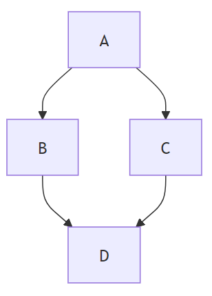
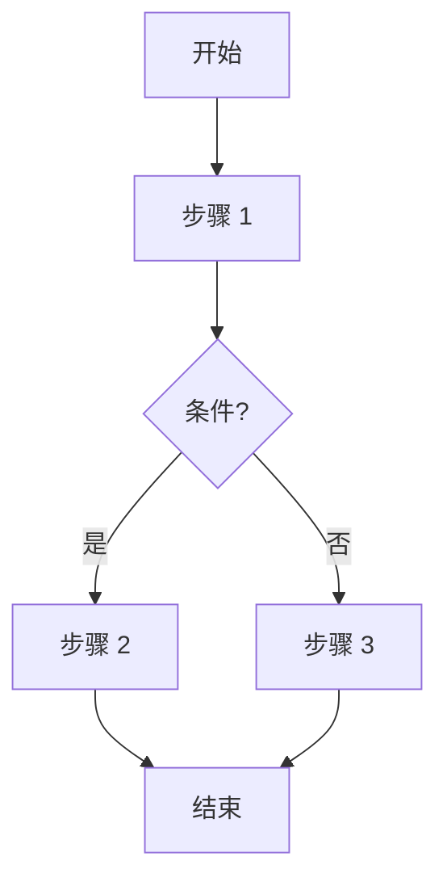

# 0001. mermaid 是什么？

## 💻 demo - 在 html 中引入 mermaid

```html
<!DOCTYPE html>
<html lang="en">
  <head>
    <meta charset="UTF-8" />
    <title>Mermaid Diagram</title>
    <script src="https://cdn.jsdelivr.net/npm/mermaid/dist/mermaid.min.js"></script>
  </head>
  <body>
    <div class="mermaid">graph TD; A-->B; A-->C; B-->D; C-->D;</div>
    <script>
      mermaid.initialize({ startOnLoad: true });
    </、script>
  </body>
</html>
```



## 🤖 ai - 你知道 https://github.com/mermaid-js/mermaid 吗？


当然，**Mermaid 是一个用于生成图表和流程图的 JavaScript 库**。它允许你使用类似于 Markdown 的简单文本语法来定义图表，然后将其渲染成 **SVG 图形**。Mermaid 支持多种图表类型，包括：

- 流程图（Flowcharts）
- 时序图（Sequence diagrams）
- 甘特图（Gantt charts）
- 类图（Class diagrams）
- 状态图（State diagrams）
- 用户旅程图（User journey diagrams）
- ER 图（Entity-Relationship diagrams）
- 蜂巢图（Pie charts, also known as "pie" in Mermaid）

Mermaid 的主要优点是它的简洁性和易用性，使得非技术人员也可以轻松创建复杂的图表。此外，Mermaid 可以集成到许多文档系统中，如 Markdown 文件、GitHub READMEs、GitLab、Confluence 和其他支持 Markdown 的平台。

### 安装和使用

#### 在网页中使用 Mermaid

你可以通过以下几种方式在网页中使用 Mermaid：

1. **CDN**：
   你可以直接在 HTML 文件中通过 CDN 引入 Mermaid：

   ```html
   <!DOCTYPE html>
   <html lang="en">
   <head>
     <meta charset="UTF-8">
     <title>Mermaid Diagram</title>
     <script src="https://cdn.jsdelivr.net/npm/mermaid/dist/mermaid.min.js"></>
   </head>
   <body>
     <div class="mermaid">
       graph TD;
         A-->B;
         A-->C;
         B-->D;
         C-->D;
     </div>
     <script>
       mermaid.initialize({ startOnLoad: true });
     </script>
   </body>
   </html>
   ```

2. **npm 包**：
   如果你使用的是 Node.js 项目，可以通过 npm 安装 Mermaid：

   ```sh
   npm install mermaid
   ```

   然后在你的 JavaScript 文件中引入并初始化 Mermaid：

   ```javascript
   import mermaid from 'mermaid';

   mermaid.initialize({ startOnLoad: true });
   ```

3. **CLI 工具**：
   Mermaid 还提供了一个 CLI 工具，可以将 Mermaid 代码转换为图片文件或其他格式。你可以通过 npm 安装 CLI 工具：

   ```sh
   npm install -g @mermaid-js/mermaid-cli
   ```

   然后使用以下命令将 Mermaid 代码转换为图像：

   ```sh
   mmdc -i diagram.mmd -o diagram.png
   ```

### 示例

下面是一个简单的 Mermaid 流程图示例：



这个示例定义了一个简单的流程图，其中包含一个开始节点、一个条件判断和两个可能的结果路径。

### 集成到其他工具

Mermaid 可以与许多工具和平台集成，例如：

- **Markdown 文档**：可以直接在 Markdown 文件中嵌入 Mermaid 代码。
- **GitHub**：可以在 GitHub 的 README 或其他 Markdown 文件中使用 Mermaid。
- **GitLab**：GitLab 也支持 Mermaid 语法。
- **Confluence**：Atlassian Confluence 提供了 Mermaid 插件。
- **VS Code**：有多个 VS Code 扩展支持 Mermaid 语法高亮和预览。

如果你有具体的问题或需要进一步的帮助，请告诉我！