# 0003. Mindmap with Mermaid.js

## 📝 summary

- 在 mermaid 中绘制 mindmap 思维导图。

## 🔗 links

- https://www.youtube.com/watch?v=dF9FAg73pQI
  - YouTube - Mindmap with Mermaid.js
- https://www.mermaidchart.com/blog/posts/from-chaos-to-clarity-exploring-mind-maps-with-mermaidjs/
  - mermaid 官方博客 - MermaidChart
  - From Chaos to Clarity: Exploring Mind Maps with MermaidJS
    - 译：从混沌到清晰：使用 Mermaid.js 探索思维导图
- https://mermaid.js.org/syntax/mindmap.html
  - mermaid 官方文档，这篇文档介绍的是如何使用 Mermaid 工具来创建思维导图（Mindmap）。
- https://fontawesome.com/v5/search
  - Font Awesome 5 图标库
- https://pictogrammers.com/library/mdi/
  - Material Design Icons 图标库

## 📒 notes - 缩进语法

- 缩进语法

```
mindmap
  Root
    A
      B
      C
```

- 或者下面这种形式

```
mindmap
Root
  A
    B
    C
```

- 最终渲染出来的效果如下

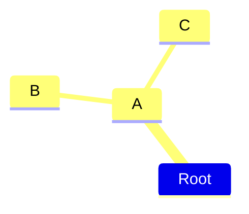

## 📒 notes - 节点形状 - 默认形状节点

```
mindmap
  I am the default shape
```
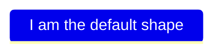

## 📒 notes - 节点形状 - 矩形节点

```
mindmap
  id[I am a square]
```
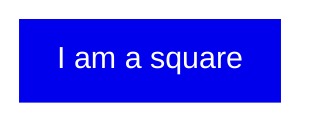

- 补充：在官方文档中，并没有提及在 mermaid 中的 id 有什么用，这里可以认为它其实没啥作用，写或者不写，最终渲染的结果都是一样的。因此在写的时候，只需要给节点包裹 `[]` 即可。
- 下面是删除 id 后的写法。

```
mindmap
  [I am a square]
```


## 📒 notes - 节点形状 - 圆角矩形节点

```
mindmap
  (I am a rounded square)
```
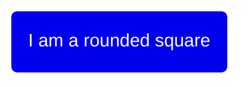

## 📒 notes - 节点形状 - 圆形节点

```
mindmap
  ((I am a circle))
```
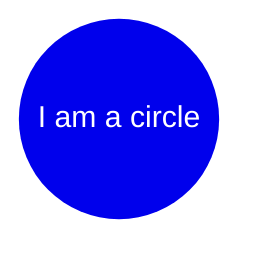

## 📒 notes - 节点形状 - 爆炸 💥 节点

```
mindmap
  ))I am a bang((
```
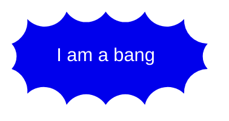

## 📒 notes - 节点形状 - 云朵 ☁️ 节点

```
mindmap
  )I am a cloud(
```
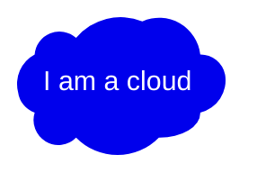

## 📒 notes - 节点形状 - 六角形节点

```
mindmap
  {{I am a hexagon}}
```
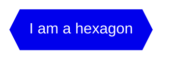

## 📒 notes - 图标语法 - `::icon()`

- 图标字体的集成
  - 集成过程：图标字体的样式需要在网页集成过程中添加，以便在网页上可用。
  - 管理员或集成者操作：这一步骤通常由网站管理员或集成者完成，而不是图表作者。这意味着你需要确保你的网站或应用已经集成了所需的图标字体库（如 Material Design 或 Font Awesome 5）。
- 实验性功能
  - 实验性质：由于这种更广泛的图标支持是实验性的，因此语法和方法可能会在未来版本中发生变化。这也是为什么思维导图被标记为实验性功能的原因之一。
- **问：如何搜索图标？**
  - 进入下面的站点，找图标。
  - https://fontawesome.com/v5/search
    - Font Awesome 5 图标库
  - https://pictogrammers.com/library/mdi/
    - Material Design Icons 图标库
    - 比如想要添加一个房子的图标，搜索到了 home 是想要的，那么只需要在对应的节点后面加上 `::icon(mdi mdi-home)` 即可。
      - 如果是在 Font Awesome 5 图标库中找到的图标，将前缀 mdi 改为 fa 即可。
    - 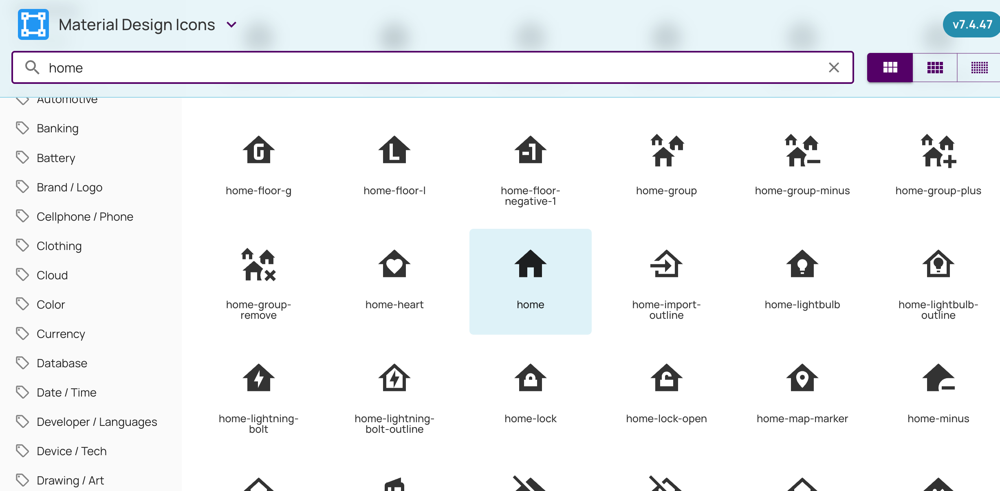

```
mindmap
  root((中心主题))
    I am a square::icon(fa fa-square)
    Another node::icon(mdi mdi-home)
    Child node
```
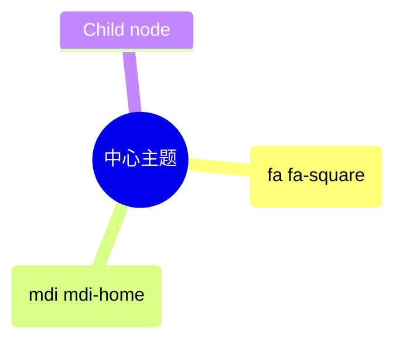
- **问：如果使用图标的话，可以在 GitHub 上正常渲染出来吗？**


## 💻 demo - 绘制思维导图测试

- 官方示例 1

```
mindmap
  )Goals for 2023(
    ))Family((
        Plan a trip together
        Call parents weekly
    ))Health((
        Less Carbs
        Gym
        Nature walks
    ))Career((
        Learn new skill
        Read more books
    ))Fun((
        Join Swim class
        Go to theatre plays
```

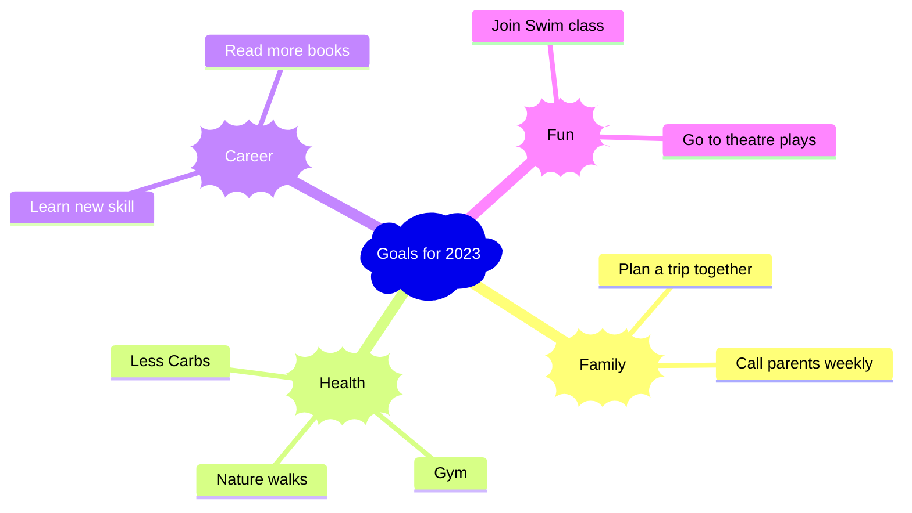

- 在 GitHub 上也是可以预览的，以下是在 VSCode 上预览的效果。
  - 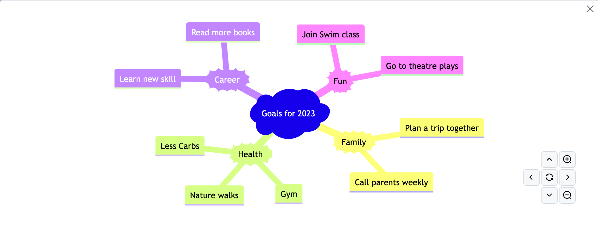
- 官方示例 2

```
mindmap
  root((mindmap))
    Origins
      Long history
      ::icon(fa fa-book)
      Popularisation
        British popular psychology author Tony Buzan
    Research
      On effectiveness<br/>and features
      On Automatic creation
        Uses
            Creative techniques
            Strategic planning
            Argument mapping
    Tools
      Pen and paper
      Mermaid
```

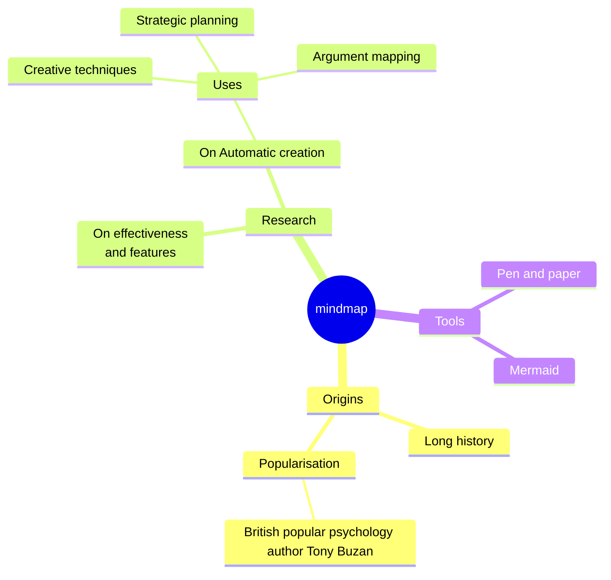

